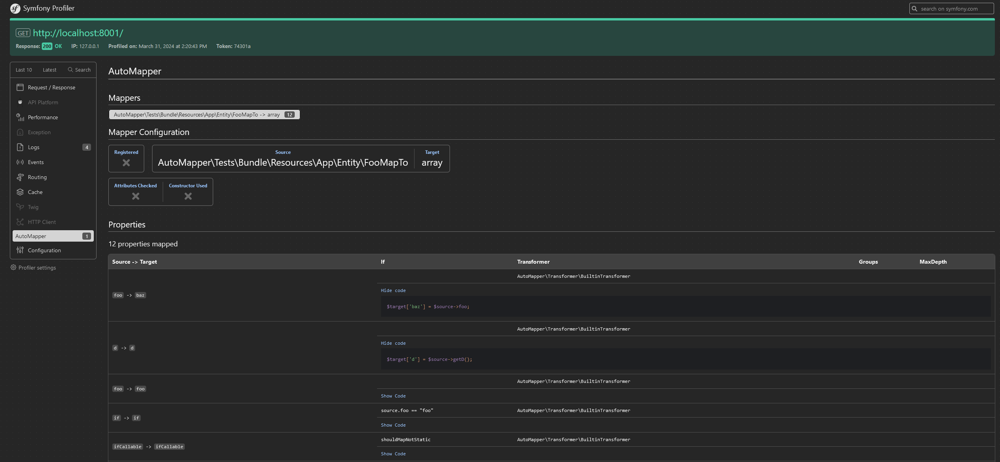

# Debug a Mapper

AutoMapper provides 2 ways to debug what's going on with a mapper when using the Symfony bundle:

## The `debug:mapper` Command

The `debug:mapper` command will display the mapping information for a specific mapper. 
This can be useful to understand how AutoMapper is mapping your objects and why some properties are not mapped.

```bash
php bin/console debug:mapper User UserDTO
```


## Using the symfony profiler

AutoMapper provides a panel in the Symfony profiler that will display the mapping information for each request. 
Please note that this only display Mapper that has been generated during the request, if you have a mapper that was not
generated during the request it will not be displayed.

You can find the panel in the Symfony profiler under the `AutoMapper` tab.




## What is displayed

Both the debug command and the profiler show the same kind of information for each mapper:

- **Property types:** For each mapped property, the source and target property names are shown **with their types** (e.g. `title (string) -> name (string)`). This helps you see how AutoMapper interprets each property and which transformer will be used.
- **Transformer:** The transformer used for each property is displayed. When the transformer supports it, a detailed description is shown (e.g. `ObjectTransformer<SourceType, TargetType>` for object-to-object mapping, or nested type information for array transformers).
- **Ignored / not used properties:** Properties that are not mapped are listed with the reason they are skipped (e.g. no matching source property, ignored by attribute, or condition not met).

In the profiler, you can also use **Show Code** for each property to see the exact generated PHP snippet that performs the mapping.
